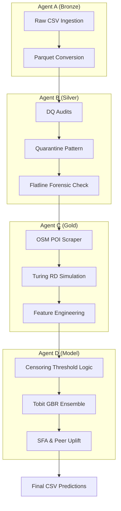

# 🌀 DataStorm 7.0 — Ctrl Freaks

**Latent Demand Estimation Pipeline for Sri Lanka Beverage Distribution (January 2026 Forecast)**

Built for the [DataStorm 7.0](https://octave.lk/datastorm/) competition by Octave John Keells Group. This project implements a production-grade **Agentic Medallion Architecture** to solve the left-censored demand problem in FMCG distribution.

---

## 📋 Table of Contents

- [Overview](#overview)
- [Key Innovations](#key-innovations)
- [Architecture](#architecture)
- [Project Structure](#project-structure)
- [Pipeline Stages](#pipeline-stages)
- [Getting Started](#getting-started)
- [Tech Stack](#tech-stack)
- [Team](#team)

---

## Overview

Ctrl Freaks' solution addresses the "min(Demand, Constraint)" problem. Observed sales are often capped by supply-side constraints (credit, delivery, storage). We estimate the **true uncapped potential** for 20,000 outlets for January 2026 using a combination of censored regression, spatial diffusion modeling, and peer-group benchmarking.

---

## Key Innovations

- **Turing Reaction-Diffusion Feature**: Inspired by Alan Turing's morphogenesis papers, we implemented a Gray-Scott RD system to compute spatial "demand pressure" activator surfaces.
- **Tobit-Style Censored Regression**: A structural modeling approach that explicitly accounts for left-censoring at observed historical peaks.
- **Agentic Medallion Pipeline**: A 4-stage pipeline (Agents A-D) that moves data from raw forensic records to model-ready features and final forecasts.
- **OSM Spatial Enrichment**: Vectorized extraction of 8,750+ POIs via the Overpass API to map outlet catchment density.

---

## Architecture



---

## Project Structure

```
.
├── data/
│   ├── bronze/               # Ingested parquet files
│   ├── silver/               # Cleaned data + rejected records
│   ├── gold/                 # Feature matrix + Turing RD states
│   └── predictions/          # Final Submission CSV
├── report/                   # Formal Typst Report
│   ├── main.typ              # Entry point
│   └── sections/             # Modular chapters
├── src/
│   ├── bronze/               # Agent A: Ingestion
│   ├── silver/               # Agent B: DQ & Forensics
│   ├── gold/                 # Agent C: POIs & Turing RD
│   ├── model/                # Agent D: Latent Demand Modeling
│   └── eda/                  # Analysis & Diagnostic Scripts
├── outputs/                  # Diagnostic Visualizations
├── run_pipeline.sh           # End-to-End Runner
└── params.yaml               # Pipeline configuration
```

---

## Pipeline Stages

### 1️⃣ Agent A — Bronze (Ingestion)
Converts raw CSV streams into type-strict Parquet structures, preserving $100\%$ of source signals with zero-loss compression.

### 2️⃣ Agent B — Silver (Forensics)
Applies a **Quarantine Pattern** to trap anomalies. Implements the **Historical Flatline Check** to detect outlets whose sales are artificially capped by credit or delivery cycles.

### 3️⃣ Agent C — Gold (Feature Engineering)
- **Overpass Scraper**: Fetches nationwide POI data (Schools, Markets, Bus Stations).
- **Turing RD**: Runs a 500-step Gray-Scott simulation to derive the `rd_demand_pressure` spatial activator feature.

### 4️⃣ Agent D — Model (Latent Estimation)
- **Tobit Ensemble**: A 50/30/20 weighted ensemble of Censored Gradient Boosting, Stochastic Frontier Analysis (SFA), and Peer-Group Uplift.
- **January Adjustment**: Applies a seasonal index to account for peak demand cycles.

---

## Getting Started

### Prerequisites
- Python 3.9+
- [Typst](https://typst.app/) (for report generation)
- [ZenML](https://zenml.io) (optional, orchestrator-agnostic)

### Installation
```bash
pip install pandas numpy scipy scikit-learn matplotlib seaborn pyarrow geopandas
```

### Running the Full Pipeline
The provided shell script executes the end-to-end flow from data ingestion to final predictions and report-ready EDA:

```bash
chmod +x run_pipeline.sh
./run_pipeline.sh
```

### Compiling the Report
To generate the formal PDF report:
```bash
typst compile report/main.typ --root .
```

---

## Tech Stack

| Domain | Tools |
|---|---|
| **Pipeline** | ZenML, DVC, Apache Arrow |
| **Analysis** | Pandas, SciPy, Scikit-Learn |
| **Spatial** | GeoPandas, Overpass API, Shapely |
| **Reporting** | Mermaid.js |

---

## Team — Ctrl Freaks

- **Sukitha Rathnayake** — MLOps, DQ Forensics, Ensemble Logic
- **Vidura Gunawardana** — Pipeline Architecture, Turing RD, Tobit Modeling
